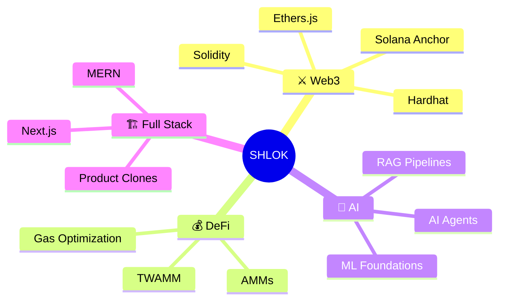

<p align="center">
  
</p>

<p align="center">
  
</p>

<p align="center">
  
  <a href="https://github.com/shlok2740?tab=followers">
    
  </a>
  <a href="https://github.com/shlok2740">
    
  </a>
</p>

---

## `> BOOT SEQUENCE`

```txt
> booting shlok.exe
> loading blockchain modules... OK
> loading ai agents... OK
> loading full-stack runtime... OK
> syncing quest log... OK
> status: ready to ship
```

---


## `> PLAYER ONE`

```
CLASS    : Full-Stack Web3 + AI Engineer
GUILD    : DeFi · RAG Systems · Product Clones
WEAPON   : Solidity · Anchor · Next.js · LangChain
LORE     : Ships fast, writes clearly, optimizes where it matters
STATUS   : [ON QUEST] — RAG pipelines & TWAMM DeFi primitives
```

| Stat | Loadout |
|---|---|
| **Class** | Web3 / AI Engineer |
| **Main Weapon** | Solidity + TypeScript |
| **Side Quest** | RAG Agents |
| **Current Level** | Shipping DeFi + AI systems |
| **Passive Skill** | Gas optimization |
| **Ultimate** | Turning complex protocols into usable products |

<br clear="right" />

---

## `> XP PROGRESS`

```txt
Solidity        ████████░░ 80%
TypeScript      █████████░ 90%
RAG Systems     ███████░░░ 70%
Solana Anchor   ██████░░░░ 60%
EVM Internals   ███████░░░ 75%
Next.js         █████████░ 90%
```

---

## `> ACTIVE QUESTS 📋`

| Priority | Quest | Status |
|:---:|---|:---:|
| 🔴 | **TWAMM DeFi primitive** — gas-optimized EVM implementation | `[IN PROGRESS]` |
| 🔴 | **Multi-agent RAG system** — vector search + eval loops | `[IN PROGRESS]` |
| 🟡 | **EVM internals deep-dive** — statistical foundations + gas | `[STUDYING]` |
| 🟢 | **Web3 product clones** — wallet flows + smart contract UX | `[ONGOING]` |

---

## `> SIDE QUESTS 🧩`

- Complete more Solana Anchor programs
- Publish Solidity gas optimization notes
- Build an AI agent memory system
- Ship more Web3 product clones
- Improve RAG evaluation and retrieval quality

---

## `> LOADOUT ⚙️`

| Build | Stack |
|---|---|
| **DeFi Build** | Solidity · Hardhat · Ethers.js · Foundry-style testing |
| **AI Build** | Python · LangChain · RAG · evaluation loops |
| **Frontend Build** | Next.js · React · Tailwind CSS · TypeScript |
| **Backend Build** | Node.js · Express · MongoDB · APIs |
| **Protocol Build** | EVM internals · gas profiling · smart contract UX |

---

## `> INVENTORY 🎒`

| Slot | Equipped |
|---|---|
| **Smart Contracts** | Solidity · Hardhat · Ethers.js · Anchor |
| **Frontend Kit** | Next.js · React · Tailwind CSS · TypeScript |
| **AI Kit** | Python · PyTorch · LangChain · RAG pipelines |
| **Backend Kit** | Node.js · Express · MongoDB · APIs |
| **Deployment Gear** | Vercel · Docker · GitHub Actions |
| **Grinding Grounds** | Kaggle · LeetCode · DoraHacks · Devpost |

---

## `> BOSS ARENA 💀`

| Boss | Weakness | Status |
|---|---|:---:|
| **EVM Internals** | Gas profiling + opcode-level reasoning | `[FIGHTING]` |
| **Solana Anchor** | Program constraints + account model | `[FIGHTING]` |
| **RAG Evaluation** | Retrieval quality + hallucination checks | `[FIGHTING]` |
| **Production UX** | Fast flows + low-friction onboarding | `[ALWAYS ACTIVE]` |

---

## `> BOSS HP`

```txt
EVM Internals    ███████░░░ 70%
Solana Anchor    ██████░░░░ 60%
RAG Evaluation   ███████░░░ 70%
Production UX    ████████░░ 80%
Gas Optimization ████████░░ 80%
```

---

## `> SKILL TREE 🌳`

<p align="center">
  
</p>

<p align="center">
  
  
  
  
  
  
  
</p>

---

## `> GAME MODES 🕹️`

| Mode | Focus |
|---|---|
| **Builder Mode** | Shipping full-stack products |
| **Research Mode** | ML foundations, statistics, and EVM internals |
| **Protocol Mode** | DeFi primitives and smart contracts |
| **Writer Mode** | Technical blogs and explainers |
| **Arena Mode** | Hackathons, experiments, and rapid prototypes |

---

## `> DUNGEON MAP 🗺️`



---

## `> CHARACTER STATS 📊`

<p align="center">
  [](https://www.readmecodegen.com/leetcode-stats-generator/leetcode-stats-card-generator-for-github)
</p>

---

## `> COMBAT LOG ⚔️`

<p align="center">
  
</p>


---

## `> PAC-MAN EATING MY COMMITS 👾`

<p align="center">
  <picture>
    <source media="(prefers-color-scheme: dark)" srcset="https://raw.githubusercontent.com/shlok2740/shlok2740/output/pacman-contribution-graph-dark.svg" />
    <source media="(prefers-color-scheme: light)" srcset="https://raw.githubusercontent.com/shlok2740/shlok2740/output/pacman-contribution-graph.svg" />
    
  </picture>
</p>

---

## `> 3D CONTRIBUTION BOARD 🧊`

<p align="center">
  
</p>

---

## `> ACHIEVEMENTS UNLOCKED 🏆`

<p align="center">
  
  
  
  
  
</p>

<p align="center">
  
</p>

---

## `> RARE DROPS 💎`

| Drop | Source |
|---|---|
| **Gas Optimization Notes** | Solidity and EVM grind |
| **RAG Agent Patterns** | AI system experiments |
| **Protocol Design Ideas** | DeFi primitive builds |
| **Product UX Lessons** | Full-stack shipping |
| **Debugging Instincts** | Long sessions in the build dungeon |

---

## `> PROOF OF WORK 📜`

| Signal | Drop Location |
|---|---|
| ⚔️ **Code** | Public repos — Web3, AI, MERN, product experiments |
| 📖 **Writing** | Medium · DEV · Hashnode — math, Solidity, AI systems |
| 🎯 **Practice** | Kaggle · LeetCode · DoraHacks · Devpost |
| 🧭 **Direction** | Systems bridging smart contracts, product engineering, and applied AI |

---

## `> FIND ME IN THE LOBBY 🎮`

<p align="center">
  <a href="https://github.com/shlok2740" target="_blank"></a>
  <a href="https://twitter.com/sk2740" target="_blank"></a>
  <a href="https://dev.to/shlok2740" target="_blank"></a>
  <a href="https://linkedin.com/in/sk2740" target="_blank"></a>
  <a href="https://medium.com/@shlokkumar2303" target="_blank"></a>
  <a href="https://hashnode.com/@YakuzaKiawe" target="_blank"></a>
  <a href="https://www.kaggle.com/shlokkumar2303" target="_blank"></a>
  <a href="https://leetcode.com/shlokkumar2303" target="_blank"></a>
  <a href="https://dorahacks.io/yakuzakiawe" target="_blank"></a>
  <a href="https://devpost.com/YakuzaKiawe" target="_blank"></a>
</p>

<p align="center">
  
</p>
