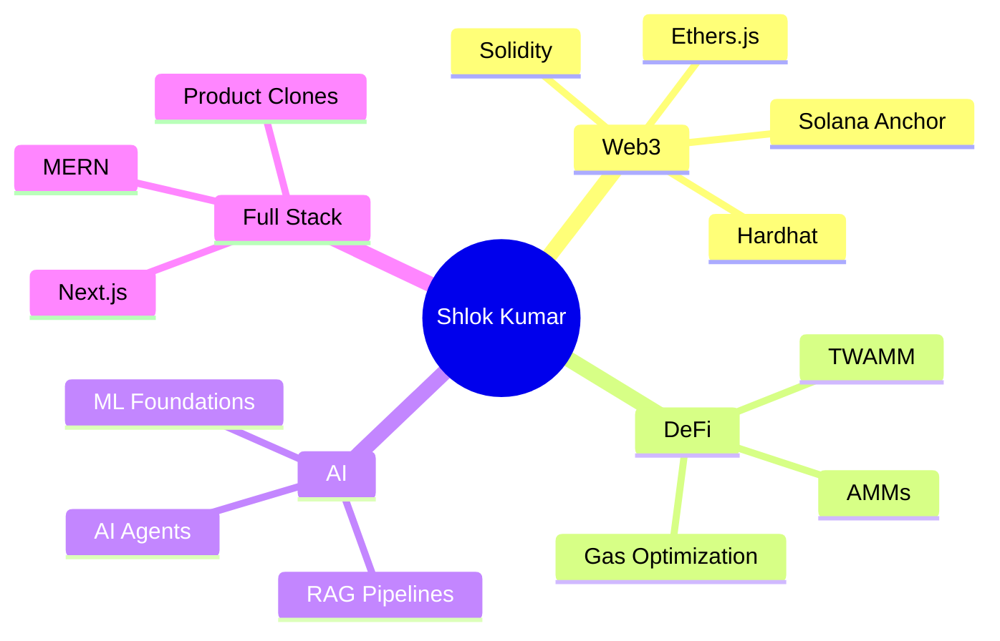

  

  

  
  
  

---

## About Me

- Building **RAG pipelines, AI agents, DeFi primitives, and Web3 applications**
- Learning deeply across **machine learning foundations, statistical theory, Solana Anchor, and EVM internals**
- Writing technical deep-dives on **linear algebra, hypothesis testing, gas optimization, and blockchain engineering**
- Ask me about **Solidity, Solana, Anchor, Hardhat, Ethers.js, RAG systems, MERN, and Next.js**
- Working style: **ship fast, write clearly, optimize where it matters**

 

---

## Current Focus

| Track | What I am building |
|---|---|
| **AI Engineering** | RAG systems, agent workflows, vector search, evaluation loops |
| **DeFi** | TWAMM primitives, AMM logic, gas-aware EVM tooling |
| **Web3 Apps** | Wallet flows, smart contract integrations, full-stack product clones |
| **Technical Writing** | Math, ML, Solidity internals, protocol design notes |

---

## Tech Stack

  

  
  
  
  
  
  
  

---

## Build Map

---

## Proof Of Work

| Signal | Where to look |
|---|---|
| **Code** | Public repositories across Web3, AI, MERN, and product experiments |
| **Writing** | Medium, DEV, Hashnode articles on math, Solidity, and AI systems |
| **Practice** | Kaggle, LeetCode, DoraHacks, Devpost, and GitHub projects |
| **Direction** | Systems that combine smart contracts, product engineering, and applied AI |

---

## Connect

  
  
  
  
  
  
  
  
  
  

---

## GitHub Stats

  
  

  

## Activity

  

## Pac-Man Contributions

  <picture>
    <source media="(prefers-color-scheme: dark)" srcset="https://raw.githubusercontent.com/shlok2740/shlok2740/output/pacman-contribution-graph-dark.svg" />
    <source media="(prefers-color-scheme: light)" srcset="https://raw.githubusercontent.com/shlok2740/shlok2740/output/pacman-contribution-graph.svg" />
    
  </picture>

## Achievements

  

  

